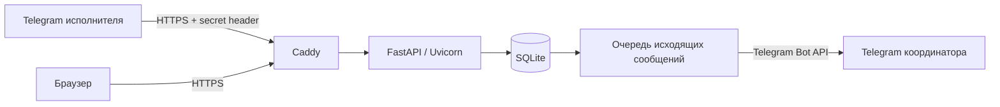

# Контроль заказов кухонной фабрики

Небольшой рабочий прототип для демонстрации автоматизации: исполнитель сообщает о проблеме в Telegram, координатор видит её в заказе и учитывает стоимость переделки. Это демонстрационные данные: 24 вымышленных заказа, три шоурума и дилеры в пяти городах.

- Сайт: https://kitchen.45-67-202-162.sslip.io
- Координатор: https://kitchen.45-67-202-162.sslip.io/admin
- Бот: https://t.me/kitchen_control_dev_bot
- [Фактические результаты проверок](docs/TEST_RESULTS.md)
- [Журнал проблем](docs/ISSUE_LOG.md)
- [Окружение и архитектура](docs/ARCHITECTURE.md)
- [Сценарий показа](docs/DEMO.md)
- [Текст работодателю](docs/EMPLOYER.md)
- [Скриншоты и их происхождение](artifacts/README.md)

Статус реальной Telegram-проверки смотрите в TEST_RESULTS: работающий webhook и тестовый HTTP payload сами по себе не доказывают весь путь из пользовательского Telegram-клиента.

## Архитектура



HTML, CSS и vanilla JavaScript. Один Python-процесс, FastAPI, SQLite, systemd; существующий Caddy. API и frontend на одном origin. Нет polling Telegram, Redis, WebSocket, регистрации и CRM-функций.

```
app/          API, расчёты, SQLite, Telegram-диалоги
static/       публичные HTML/CSS/JS и снимок учебных данных
templates/    защищённая HTML-страница координатора
scripts/      seed, настройка бота, пользователи, backup, проверки браузером
tests/        unittest: бизнес-правила, API, Telegram, безопасность
deploy/       systemd, Caddy, выкладка и диагностика
data/         рабочая SQLite, WAL и backup; не публикуются и не входят в Git
docs/         документация и результаты
artifacts/    реальные скриншоты и результаты проверок
```

## Установка и локальный запуск

Требуется Python 3.12+; проверено на Python 3.12 (Ubuntu) и 3.14 (Windows). Для сервера не нужны Node.js и браузер.

Linux/macOS:

```bash
python3 -m venv .venv
.venv/bin/python -m pip install -r requirements-lock.txt
cp -n .env.example .env
.venv/bin/python -m scripts.seed
.venv/bin/uvicorn app.main:app --host 127.0.0.1 --port 8000
```

Windows PowerShell:

```powershell
python -m venv .venv
.venv\Scripts\python -m pip install -r requirements-lock.txt
# Только если .env ещё не существует:
Copy-Item .env.example .env
.venv\Scripts\python -m scripts.seed
.venv\Scripts\python -m uvicorn app.main:app --host 127.0.0.1 --port 8000
```

Откройте http://127.0.0.1:8000. Локальные секреты уже созданной установки находятся в `.env`; не перезаписывайте его примером. Для разработки admin на loopback разрешается `ALLOW_LOCAL_HTTP=true`. На сервере обязательно `false`; там admin работает только через HTTPS.

## Настройки

| Переменная | Назначение |
|---|---|
| `DATABASE_PATH` | По умолчанию `data/app.db`, относительно каталога проекта |
| `PUBLIC_BASE_URL` | Публичный HTTPS origin без завершающего `/` |
| `ADMIN_USERNAME` | Логин координатора |
| `ADMIN_PASSWORD` | Случайный пароль, только в `.env` / EnvironmentFile |
| `TELEGRAM_BOT_TOKEN` | Токен отдельного бота от @BotFather |
| `TELEGRAM_WEBHOOK_SECRET` | Случайный секрет: латиница, цифры, `_`, `-` |
| `COORDINATOR_TELEGRAM_ID` | ID пользователя-координатора, который также внесён в allowlist |
| `ALLOW_LOCAL_HTTP` | Только локальная разработка; в production `false` |

`DEMO_DATE = 2026-09-30` и `LOW_MARGIN_THRESHOLD = 15` определены в `app/config.py`. Они передаются frontend через API/учебный снимок. Дата демонстрации используется для просрочек; реальные временные отметки событий хранятся отдельно, в UTC.

Ни токен, ни пароль не передаются frontend. `.env` исключён из Git, SQLite находится вне static. Для входа в `/admin` используйте `ADMIN_USERNAME` и `ADMIN_PASSWORD` из локального `.env`. Лучше открывать admin в приватном окне: HTTP Basic кэшируется браузером до завершения сессии.

## База и воспроизводимый seed

```bash
.venv/bin/python -m scripts.seed
.venv/bin/python -m scripts.seed --export
```

Повторный seed сохраняет существующие данные и не создаёт дубли. `--export` обновляет `static/demo-data.json`; экспортируйте исходный учебный набор, а не реальные персональные сведения.

Для **осознанного удаления учебных бизнес-событий**:

```bash
.venv/bin/python -m scripts.manage backup data/before-reset.db
sudo systemctl stop kitchen-control
sudo -u kitchen-control .venv/bin/python -m scripts.seed --reset
sudo systemctl start kitchen-control
```

`--reset` очищает заказы, задания, историю, состояния диалогов и очередь, но сохраняет allowlist пользователей. Выполняйте при остановленном сервисе. Старые кнопки в Telegram после reset не используйте: начинайте с `/start`.

Заказы для живой демонстрации: **КФ-2601** и **КФ-2603** — монтаж (`INSTALL-01`); **КФ-2602** — замер (`MEASURE-01`). Остальные задачи относятся к другим исполнителям и проверяют изоляцию.

## Telegram: подключение

1. Создайте одного бота через @BotFather; сохраните токен в `.env`.
2. Сначала поднимите публичный HTTPS сайт и убедитесь, что `/api/health` отвечает.
3. Зарегистрируйте webhook:

```bash
.venv/bin/python -m scripts.manage webhook
.venv/bin/python -m scripts.manage telegram-info
```

Скрипт передаёт `secret_token`, разрешает `message`/`callback_query`, не удаляет ожидающие updates. Backend проверяет `X-Telegram-Bot-Api-Secret-Token`; неизвестный или отсутствующий секрет получает 403. Вызовы с неверным секретом не принимаются как пользовательские события.

4. Каждый тестовый пользователь открывает бота и нажимает `/start`. Неизвестному пользователю бот показывает его ID и не показывает задания.
5. Добавьте ID в allowlist на сервере:

```bash
sudo -u kitchen-control .venv/bin/python -m scripts.manage add-user 111111111 installer INSTALL-01 'Илья Мартынов'
sudo -u kitchen-control .venv/bin/python -m scripts.manage add-user 222222222 measurer MEASURE-01 'Павел Лесков'
sudo -u kitchen-control .venv/bin/python -m scripts.manage add-user 333333333 coordinator COORD-01 'Мария Орлова'
```

Числа выше — только примеры, замените реальными ID. Укажите ID координатора в `COORDINATOR_TELEGRAM_ID`, затем перезапустите сервис. Координатор тоже должен первым открыть бота: бот не может начать личный диалог сам.

Для сценария с одним аккаунтом роли можно переключать командой `add-user`, сохраняя вымышленное отображаемое имя. Это проверка ролей последовательно, а не доказательство одновременного обмена между двумя людьми.

6. Пользователь повторяет `/start` или `/tasks`. Исполнитель видит только свои задания; права повторно проверяются при каждом действии и перед подтверждением.

Команды: `/start`, `/tasks`, `/cancel`. Действия: «Принял задание», «Есть проблема», «Нужен перенос», «Выполнено». Многошаговый диалог хранится в SQLite и переживает перезапуск. Устаревшие кнопки подтверждения отклоняются по nonce. Диалог истекает через 24 часа.

### Доставка и повторные updates

Уникальный `update_id`, бизнес-изменения, история, состояние диалога и исходящие сообщения фиксируются одной транзакцией `BEGIN IMMEDIATE`. Повторный update возвращает 200 с `duplicate=true` и не создаёт новых операций или уведомлений.

Исходящие сообщения хранятся в `telegram_outbox`. Один worker внутри приложения доставляет их через Telegram Bot API. Успешная отправка координатору создаёт отдельное системное событие. Сбой не выдаётся за успех.

У Telegram `sendMessage` нет клиентского ключа идемпотентности. Если сеть оборвалась после отправки или процесс умер до записи ответа, невозможно достоверно определить, получено ли сообщение. Такие записи имеют `uncertain` и **не повторяются автоматически**, чтобы не создавать дубли. `failed` — явный отказ API. После устранения причины оператор проверяет доставку вручную; инструмент автоматического повторного уведомления намеренно не добавлен.

```bash
sudo -u kitchen-control .venv/bin/python -m scripts.manage outbox
```

Неподключённый координатор также оставляет явное событие в истории заказа. Для приёмки проекта необходима реальная проверка доставки, а не только запись в очереди.

## Сроки и экономика

На главной странице есть компактный дашборд: шесть кликабельных KPI, этапы и сроки, общая экономика, распределение маржинальности и пять заказов для внимания. Все показатели используют расчёты карточек из backend; новых таблиц или библиотек графиков нет. [Правила сводки и проверки](docs/DASHBOARD.md).

- Активная просрочка: первоначальный срок раньше `DEMO_DATE`, заказ не завершён.
- Риск задержки: прогноз позже первоначального срока. Это отдельный признак.
- Завершённый заказ оценивается по фактической дате завершения и не попадает в активную просрочку.
- Запрос переноса записывается в задание; исходный срок и официальный прогноз не меняются.
- Завершение монтажа переводит заказ в **«Приёмка»**, замера — в **«Проектирование»**. Автоматического закрытия заказа нет.
- Переменные расходы: материалы + изготовление + доставка + монтаж + комиссия + переделки.
- Маржинальный доход: выручка − переменные расходы. Это **не чистая прибыль**.
- `NULL` = отсутствует значение; `0` = подтверждённый нулевой расход. План не подставляется вместо факта.
- При неполных данных итоговая экономика не рассчитывается. При нулевой выручке процент отсутствует.
- Деньги проверяются через Decimal; принимаются неотрицательные суммы с максимум двумя десятичными знаками.

## Имитация без backend

В рабочем интерфейсе явно выберите «Режим имитации». Кнопка «Смоделировать сообщение монтажника» меняет только локальную копию КФ-2601 и добавляет событие `source=simulation`; SQLite и Telegram не используются. Обновление сбрасывает локальную имитацию.

Чтобы показать frontend при отключённом backend:

```bash
.venv/bin/python -m scripts.offline
```

Откройте http://127.0.0.1:8080 и выберите режим имитации. Сервер публикует только static, а не весь каталог проекта. При недоступном API рабочий режим не переключается в имитацию сам: сохраняется прежняя отметка времени и показывается предупреждение об устаревших данных.

## Production deployment

Перед первой выкладкой проверьте сервер, свободный порт, сеть контейнера Caddy и другие virtual hosts. Файлы в `deploy/` отражают **фактически проверенное окружение этого сервера**, не универсальны для произвольного VPS.

```powershell
.venv\Scripts\python deploy/push.py root@45.67.202.162 --key C:\Users\Acer\.ssh\playlens_deploy
```

Скрипт использует проверенный SSH host key, загружает код и приватный `.env`, создаёт `/opt/kitchen-control`, отдельного системного пользователя и virtualenv. SQLite хранится в `data/`; исходный код принадлежит root, база — пользователю сервиса. Секреты: root:kitchen-control, `640`, каталог проекта `750`.

Сервис слушает **172.18.0.1:18080**, только внутренний Docker bridge. Это исключение из предпочтения `127.0.0.1`: существующий Caddy работает в контейнере и не имеет доступа к loopback хоста. Публичный IP на 18080 не слушается. Proxy headers доверяются только проверенному адресу Caddy `172.18.0.3`. Если контейнер пересоздан с другим IP, обновите соответствующий параметр service и перепроверьте HTTPS/admin.

`deploy/install.sh` сохраняет резервную копию Caddyfile, добавляет только новый virtual host, выполняет `caddy validate` и лишь затем `caddy reload`. При ошибке восстанавливает предыдущий файл. Существующие virtual hosts не переписываются. У Caddy уже был рабочий механизм получения HTTPS; сертификат нового host получен и проверен снаружи.

systemd: непривилегированный пользователь, один worker, автоматический restart, ограничение памяти 220 МБ, запись только в `data/`, автозапуск после загрузки. Проверки:

```bash
systemctl status kitchen-control
systemctl is-enabled kitchen-control
journalctl -u kitchen-control -n 100 --no-pager
curl -fsS https://kitchen.45-67-202-162.sslip.io/api/health
docker exec caddy caddy validate --config /etc/caddy/Caddyfile --adapter caddyfile
```

Доступность соседних приложений проверена после Caddy reload. Фактическую перезагрузку всего VPS не выполняли: на нём другие сервисы. Проверены stop/start/restart именно kitchen-control и сохранность данных; включение автозапуска проверено отдельно.

### Backup и восстановление

```bash
cd /opt/kitchen-control
sudo -u kitchen-control .venv/bin/python -m scripts.manage backup data/backup-2026-09-30.db
```

Используется SQLite backup API: копия согласована и учитывает WAL. Путь должен быть новым — существующие файлы не перезаписываются. Для восстановления: остановить сервис, сохранить текущую базу отдельным backup, проверить `PRAGMA integrity_check` резервной копии, заменить `data/app.db`, убрать старые WAL/SHM **только этой остановленной базы**, вернуть владельца kitchen-control и запустить сервис. Не копируйте один `app.db` у работающего процесса обычным `cp`.

## Проверки

```bash
.venv/bin/python -m unittest discover -s tests -v
```

Стандартный unittest, без тяжёлого тестового framework. Тесты создают временную SQLite и подменяют только исходящий Telegram transport. Они не отправляют сообщения реальным пользователям.

Браузерные проверки на Windows:

```powershell
.venv\Scripts\python -m pip install -r requirements-dev.txt
.venv\Scripts\python -m scripts.browser_check
.venv\Scripts\python -m scripts.dashboard_check
.venv\Scripts\python -m scripts.public_check
```

`browser_check` использует изолированную локальную базу. `dashboard_check` проверяет публичный дашборд без изменения данных. `public_check` работает с публичным demo URL, меняет переделку КФ-2601 через admin, фиксирует доказательства и возвращает исходную сумму с сохранением аудита. Используется установленный Chrome. На машине без браузера установите Playwright Chromium (`python -m playwright install chromium`) и адаптируйте путь в public_check.

Результаты и скриншоты записываются в `artifacts/`. Они не содержат токены, Basic Auth и секретные заголовки.

## Границы прототипа

Публичное чтение допустимо только для вымышленных данных. Нет регистрации, официального согласования переноса, закрытия приёмки, разрешения проблем, планировщика назначений или хранения фотографий: это вне задания. Фото сохраняется только как Telegram file_id, публичный API его не раскрывает. Для production с реальными клиентами нужны отдельные требования к доступу и данным.

Сохраните ссылку на текущую AI-сессию либо скриншоты ключевых этапов; они подтверждают использование AI при разработке.

## Проверенные первичные источники

- [Telegram Bot API: setWebhook и secret_token](https://core.telegram.org/bots/api#setwebhook)
- [FastAPI: HTTP Basic Auth](https://fastapi.tiangolo.com/advanced/security/http-basic-auth/)
- [Caddy: reverse_proxy](https://caddyserver.com/docs/caddyfile/directives/reverse_proxy)
- [sslip.io / nip.io: DNS и HTTPS](https://nip.io/)

Проверено 30.09.2026. Технический DNS-адрес работает без покупки домена; условия и доступность внешнего DNS-сервиса не гарантируются навсегда.
