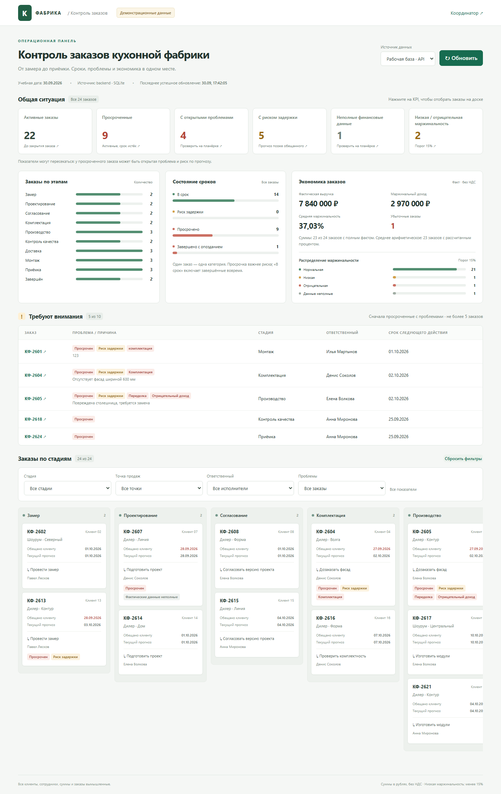

# Контроль заказов кухонной фабрики

Работающий учебный прототип: координатор видит сроки, проблемы, следующие действия и экономику заказов; замерщик и монтажник передают изменения через Telegram. База содержит 24 вымышленных заказа, три шоурума и дилеров в пяти городах. Дата расчёта просрочек фиксирована — **30.09.2026**.

- [Публичный сайт](https://kitchen.45-67-202-162.sslip.io) · [Admin](https://kitchen.45-67-202-162.sslip.io/admin) · [Telegram-бот](https://t.me/kitchen_control_dev_bot).
- [Публичный репозиторий](https://github.com/CRYCas0n/kitchen-order-control-demo), основная ветка `main`. Секреты, рабочая база и резервные копии не публикуются.
- **39 автоматических тестов**; реальные результаты и ограничения — [TEST_RESULTS.md](docs/TEST_RESULTS.md).



## Архитектура

Python/FastAPI обслуживает HTML/CSS/обычный JavaScript и JSON API, вычисляет показатели и сохраняет данные в SQLite. Telegram присылает updates в защищённый webhook; изменения, история и очередь сообщений записываются транзакционно. Один фоновый обработчик отправляет ответы/уведомления. На VPS один Uvicorn под systemd, HTTPS через существующий Caddy в Docker. Node.js, сборка frontend и отдельная аналитическая БД не требуются. Сайт обновляется кнопкой, а не в реальном времени.

## Быстрый локальный запуск

Python 3.12+. Репозиторий доступен для чтения без приглашения. После clone войдите в его корень.

Linux/macOS:

```bash
python3 -m venv .venv
.venv/bin/python -m pip install -r requirements-lock.txt
test -e .env || cp .env.example .env
.venv/bin/python -m scripts.seed
.venv/bin/python -m uvicorn app.main:app --host 127.0.0.1 --port 8000
```

Windows PowerShell:

```powershell
python -m venv .venv
.venv\Scripts\python -m pip install -r requirements-lock.txt
if (-not (Test-Path -LiteralPath '.env')) { Copy-Item -LiteralPath '.env.example' -Destination '.env' }
.venv\Scripts\python -m scripts.seed
.venv\Scripts\python -m uvicorn app.main:app --host 127.0.0.1 --port 8000
```

Откройте http://127.0.0.1:8000, проверьте `/api/health`. Для локального admin задайте собственный ADMIN_PASSWORD и ALLOW_LOCAL_HTTP=true в приватном `.env`, затем перезапустите процесс. По умолчанию доступ к admin закрыт; для просмотра Telegram token не нужен. Production требует HTTPS и ALLOW_LOCAL_HTTP=false. Повтор seed сохраняет существующие заказы; `--reset` не является командой обновления.

Тесты: `.venv/bin/python -m unittest discover -s tests -v` (Windows — `.venv\Scripts\python`). Полная установка, Telegram и browser checks — по ссылкам ниже.

## Документация

| Документ | Для чего |
|---|---|
| [Project overview](docs/PROJECT_OVERVIEW.md) | Назначение, реализованные потоки и границы проекта |
| [User guide](docs/USER_GUIDE.md) | Сводка, фильтры, карточки, сроки и экономика простым языком |
| [Telegram guide](docs/TELEGRAM_GUIDE.md) | Замерщик, монтажник, координатор и частые ситуации |
| [Business rules](docs/BUSINESS_RULES.md) | Стадии, даты, действия, формулы и агрегаты |
| [Technical guide](docs/TECHNICAL_GUIDE.md) | Модули, потоки данных, frontend/backend и обработка ошибок |
| [API](docs/API.md) | Все существующие маршруты, input/output, авторизация и ошибки |
| [Database](docs/DATABASE.md) | Реальные таблицы, связи, NULL, seed, backup и идемпотентность |
| [Setup](docs/SETUP.md) | Clone, venv, настройки, локальный запуск и тесты |
| [Deployment](docs/DEPLOYMENT.md) | Фактический VPS, systemd/Caddy и безопасная выкладка |
| [Operations](docs/OPERATIONS.md) | Диагностика, пользователи, credentials, backup/restore |
| [Troubleshooting](docs/TROUBLESHOOTING.md) | Симптом → причина → проверка → исправление |
| [Security](docs/SECURITY.md) | Секреты, защита приложения и checklist передачи |
| [Testing](docs/TESTING.md) | Автотесты, browser/manual E2E и влияние служебных scripts |
| [Demo script](docs/DEMO_SCRIPT.md) | Показ за 2–3 минуты с короткими репликами |
| [Limitations](docs/LIMITATIONS.md) | Что прототип не делает и что не проверено |
| [Glossary](docs/GLOSSARY.md) | Словарь пользовательских и технических терминов |
| [Test results](docs/TEST_RESULTS.md) | Фактические PASS/FAIL/NOT TESTED, включая исторические этапы |
| [Issue log](docs/ISSUE_LOG.md) | Реальные найденные проблемы и исправления; история сохранена |
| [Documentation review](docs/DOCUMENTATION_REVIEW.md) | Источники, сверки документации и найденные расхождения |

Дополнительно: [историческое обследование сервера](docs/ARCHITECTURE.md), [текст для работодателя](docs/EMPLOYER.md), [подтверждения Telegram](docs/TELEGRAM_RECEIPTS.md), [происхождение скриншотов и отчётов](artifacts/README.md). Старые ссылки [DEMO.md](docs/DEMO.md) и [DASHBOARD.md](docs/DASHBOARD.md) ведут к актуальным руководствам.

Начинающему пользователю: User guide → Telegram guide. Разработчику: Project overview → Setup → Technical guide → Business rules/API/Database. Администратору: Deployment → Operations → Security → Troubleshooting.

## Существенные границы

Монтаж переводит заказ в **«Приёмку»**, не закрывает его и не снимает открытую проблему. Запрос переноса не меняет первоначальный срок/прогноз. `NULL` не равен нулю; маржинальный доход не является чистой прибылью. Admin меняет только фактическую стоимость переделки. Публичное чтение предназначено для учебных данных; `.env`, рабочая SQLite и backup не входят в Git.

Прежний Telegram E2E подтверждён настоящими аккаунтами; новый живой прогон после финальных исправлений не проводился по выбору владельца. Это отделено от 39 автотестов и браузерных проверок в Test results.
